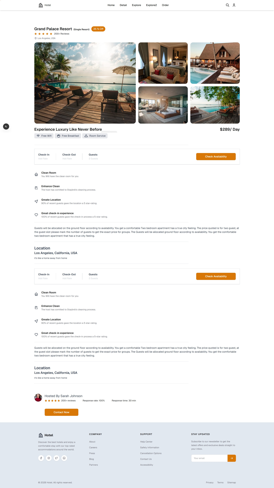
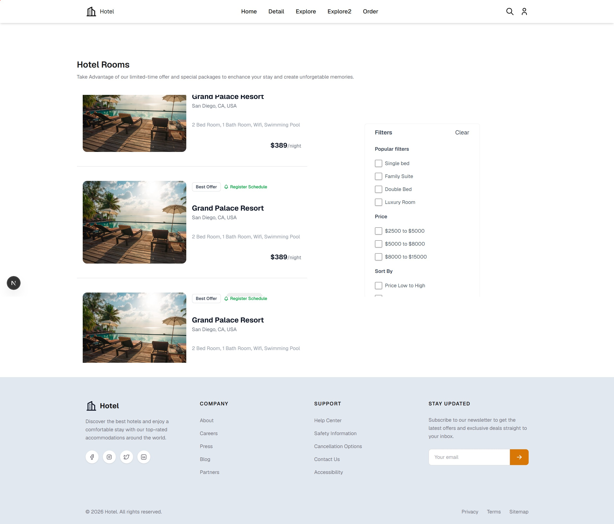
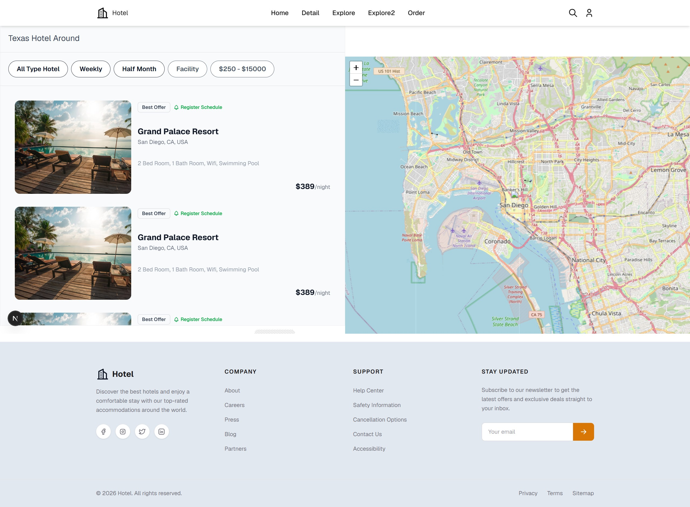
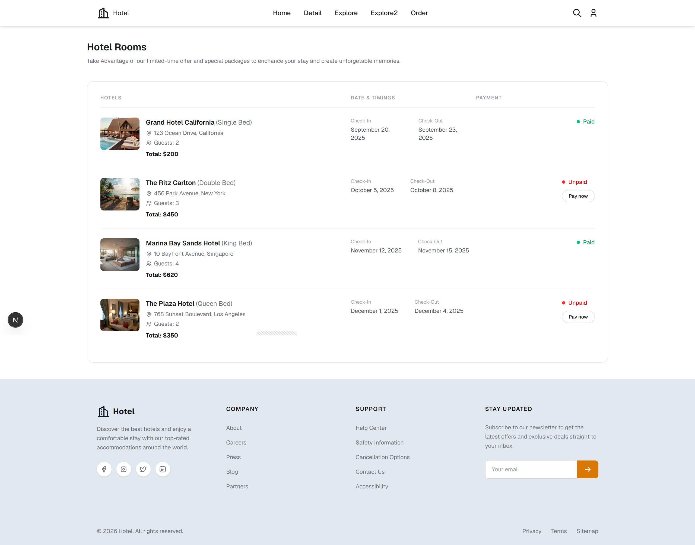

# 🏨 Hotel Booking App

A modern **hotel booking web application** built with **Next.js** as the framework and **Tailwind CSS** for the design system. The app lets users browse popular hotels, explore hotel listings with an interactive map, view detailed hotel information, and manage their reservations.

---

## 📸 Screenshots

| Page | Preview |
| --- | --- |
| Landing Page |  |
| Hotel Detail |  |
| Hotel List (Explore) |  |
| Hotel List (Explore 2) |  |
| Order / Reservation |  |

---

## ✨ Features

- **Landing Page (`/`)** — Full-screen hero section with a dark overlay, a hotel/city search bar, a "Popular Hotel" best-seller grid, and a footer with social media links.
- **Hotel Detail (`/detail`)** — Detailed hotel information including star ratings, discount badges, amenity icons (Wi-Fi, restaurant, laundry, etc.), and an embedded **interactive Leaflet map**.
- **Explore (`/explore` & `/explore2`)** — Two different hotel listing layouts that combine hotel cards with a **live map view** powered by Leaflet + OpenStreetMap.
- **Order / Reservations (`/order`)** — A list of reservations showing bed type, address, number of guests, check-in/check-out dates, total price, and payment status.
- **Responsive Navbar** — A fixed navigation bar that changes its style (transparent → solid with shadow) as the user scrolls.
- **Fully Responsive** — Layouts adapt gracefully from mobile to desktop using responsive utility classes.

---

## 🛠️ Tech Stack

| Technology | Purpose |
| --- | --- |
| [Next.js](https://nextjs.org/) (v16) | React framework for routing, pages, and server-side rendering |
| [React](https://react.dev/) (v19) | UI component library |
| [Tailwind CSS](https://tailwindcss.com/) (v4) | Utility-first CSS framework used for **all** styling and design |
| [Tabler Icons](https://tabler.io/icons) | Icon set used across the UI |
| [Leaflet](https://leafletjs.com/) + [react-leaflet](https://react-leaflet.js.org/) | Interactive maps on the Detail and Explore pages |

---

## 🎨 Design Approach (Tailwind CSS)

The entire visual design of this application is built with **Tailwind CSS** utility classes — no custom CSS files or CSS-in-JS libraries were needed:

- **Utility-first styling** — Every component is styled directly in JSX with classes like `flex`, `grid`, `rounded-2xl`, `shadow-sm`, and `transition-all`, keeping styles colocated with the markup.
- **Design tokens** — Spacing, colors, shadows, and rounded corners come from Tailwind's default design system, ensuring a consistent look and feel.
- **Hero overlay effect** — The landing page hero uses `bg-black/50` over a background image to create a cinematic, readable banner.
- **Glassmorphism** — The search input on the hero uses `backdrop-blur` with semi-transparent backgrounds for a modern glass effect.
- **Card grid layouts** — Hotel cards are arranged with responsive grids (`grid-cols-1` → `sm:grid-cols-2` → `lg:grid-cols-3`) that reflow automatically at breakpoints.
- **Interactive states** — Hover effects (`hover:shadow-md`, `hover:bg-secondary-dark`) and scroll-triggered navbar transitions (`bg-transparent` → `bg-white shadow-md`) are implemented purely with Tailwind utilities.
- **Responsive behavior** — Breakpoint prefixes (`sm:`, `md:`, `lg:`) handle navigation, grids, and typography across screen sizes.
- **Custom accent colors** — A `secondary` color (defined via the theme) is used for call-to-action buttons and highlights like the discount badge.

---

## 🧱 Project Structure

```
tailwindhotelbooking/
├── public/
│   └── images/              # Screenshots used in this README
├── src/
│   └── app/
│       ├── layout.js        # Root layout
│       ├── page.js          # Landing page (Home)
│       ├── globals.css      # Global styles + Tailwind entry point
│       ├── home/            # Home sections
│       ├── detail/          # Hotel detail page (with Leaflet map)
│       ├── explore/         # Hotel list view #1 (with map)
│       ├── explore2/        # Hotel list view #2
│       ├── order/           # Reservations / orders page
│       └── components/
│           └── mapleaflet/  # Reusable Leaflet map component
├── package.json
├── next.config.mjs
├── postcss.config.mjs
└── tailwindcss (v4)
```

---

## 🚀 Getting Started

```bash
# 1. Install dependencies
npm install

# 2. Run the development server
npm run dev
```

Open [http://localhost:3000](http://localhost:3000) with your browser to see the app.

```bash
# Production build
npm run build
npm start
```

---

## 📦 Available Scripts

| Script | Description |
| --- | --- |
| `npm run dev` | Start the Next.js development server |
| `npm run build` | Create a production build |
| `npm start` | Start the production server |
| `npm run lint` | Run ESLint |
